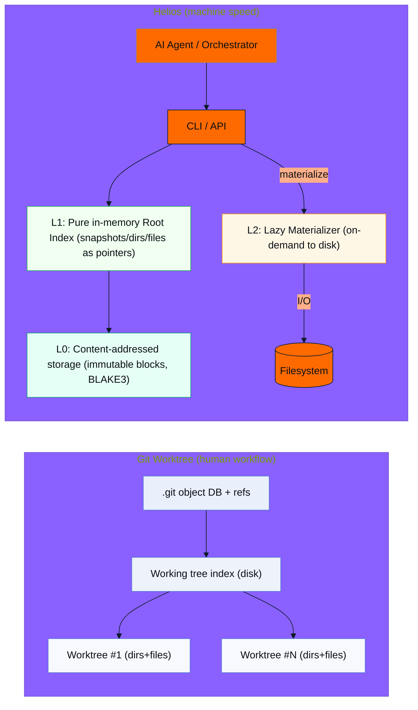

# Helios vs. Git Worktree Architecture

Key points:
- Git centers on on-disk files/index; Helios centers on immutable blocks + in-memory index.
- Branch/merge in Helios are pointer-level operations, enabling machine-speed branching.

