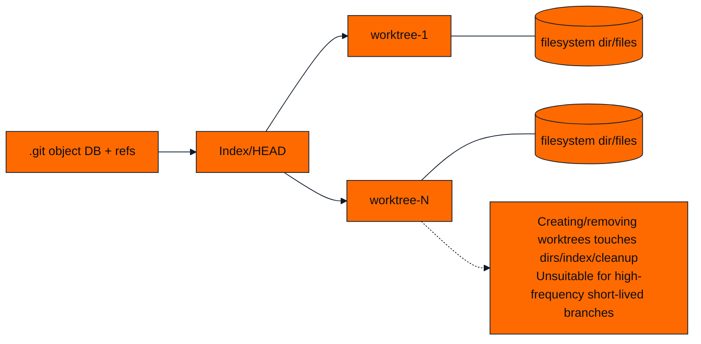

# Git Worktree Structure (Supplement)

Key points:
- Multiple worktrees are coupled with refs, on-disk index and filesystem.
- High churn for creating/cleaning trees; not suitable for thousands of short-lived branches per minute.

