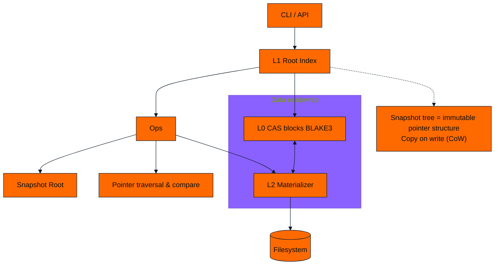

# Helios Internal Architecture

Key points:
- L1 in-memory index stores immutable pointers for snapshots/dirs/files; Copy-on-Write occurs only on modification.
- Stats/diff at pointer level; execution triggers L2 to materialize from L0 to disk on demand.

