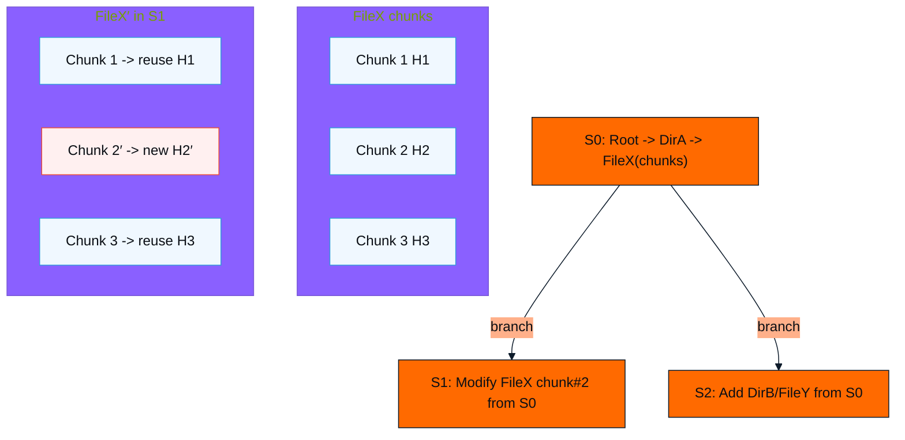

# Copy-on-Write Snapshot Tree

Key points:
- Only the modified path is updated; all other subtrees share pointers to originals.
- Branch/merge operate on pointers, near O(1) overhead.

```mermaid
%%{init: { 'theme': 'base', 'themeVariables': {
  'primaryColor': '#FF6A00',
  'primaryTextColor': '#0A0E14',
  'primaryBorderColor': '#0D1B2A',
  'lineColor': '#0D1B2A',
  'secondaryColor': '#FFB08A',
  'tertiaryColor': '#8A60FF',
  'background': '#F6F4EE'
}} }%%
flowchart TD
  S0["S0: Root -> DirA -> FileX(chunks)"]
  S1["S1: Modify FileX chunk#2 from S0"]
  S2["S2: Add DirB/FileY from S0"]

  S0 -->|branch| S1
  S0 -->|branch| S2

  subgraph "FileX chunks"
    X1[Chunk 1 H1]:::blk
    X2[Chunk 2 H2]:::blk
    X3[Chunk 3 H3]:::blk
  end

  subgraph "FileX′ in S1"
    X1a[Chunk 1 -> reuse H1]:::blk
    X2a[Chunk 2′ -> new H2′]:::newblk
    X3a[Chunk 3 -> reuse H3]:::blk
  end

  classDef blk fill:#f0f8ff,stroke:#3498db;
  classDef newblk fill:#fff0f0,stroke:#e74c3c;
```
