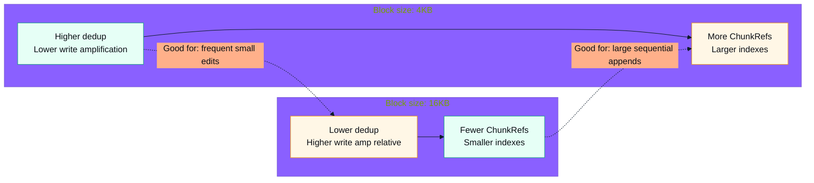

# CoW Write Amplification vs Block Size (4KB vs 16KB)

Key points:
- Smaller blocks increase dedup granularity and reduce write amplification, but raise metadata/lookup overhead.
- Choose block size by balancing locality of edits vs metadata cost.

