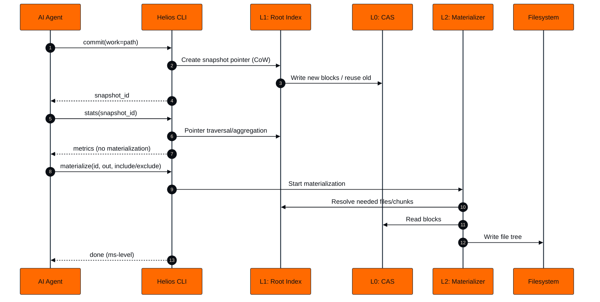

# Lazy Materialization (Sequence)

Key points:
- Only materialize to disk when execution (build/test/run) needs it.
- Regular stats/diff are done at the L1 pointer layer.

```mermaid
%%{init: { 'theme': 'base', 'themeVariables': {
  'primaryColor': '#FF6A00',
  'primaryTextColor': '#0A0E14',
  'primaryBorderColor': '#0D1B2A',
  'lineColor': '#0D1B2A',
  'secondaryColor': '#FFB08A',
  'tertiaryColor': '#8A60FF',
  'background': '#F6F4EE'
}} }%%
sequenceDiagram
  autonumber
  participant Agent as AI Agent
  participant CLI as Helios CLI
  participant L1 as L1: Root Index
  participant L0 as L0: CAS
  participant L2 as L2: Materializer
  participant FS as Filesystem

  Agent->>CLI: commit(work=path)
  CLI->>L1: Create snapshot pointer (CoW)
  L1->>L0: Write new blocks / reuse old
  CLI-->>Agent: snapshot_id

  Agent->>CLI: stats(snapshot_id)
  CLI->>L1: Pointer traversal/aggregation
  CLI-->>Agent: metrics (no materialization)

  Agent->>CLI: materialize(id, out, include/exclude)
  CLI->>L2: Start materialization
  L2->>L1: Resolve needed files/chunks
  L2->>L0: Read blocks
  L2->>FS: Write file tree
  CLI-->>Agent: done (ms-level)
```

