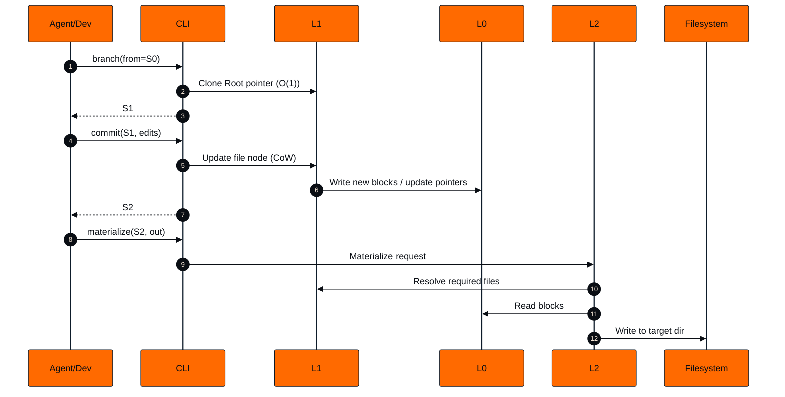

# Core Workflows (Branch/Commit/Materialize)

Key points:
- Branch = create a new Root pointer; Commit = CoW update; Materialize only when needed for execution.

```mermaid
%%{init: { 'theme': 'base', 'themeVariables': {
  'primaryColor': '#FF6A00',
  'primaryTextColor': '#0A0E14',
  'primaryBorderColor': '#0D1B2A',
  'lineColor': '#0D1B2A',
  'secondaryColor': '#FFB08A',
  'tertiaryColor': '#8A60FF',
  'background': '#F6F4EE'
}} }%%
sequenceDiagram
  autonumber
  participant Dev as Agent/Dev
  participant CLI as CLI
  participant L1 as L1
  participant L0 as L0
  participant L2 as L2
  participant FS as Filesystem

  Dev->>CLI: branch(from=S0)
  CLI->>L1: Clone Root pointer (O(1))
  CLI-->>Dev: S1

  Dev->>CLI: commit(S1, edits)
  CLI->>L1: Update file node (CoW)
  L1->>L0: Write new blocks / update pointers
  CLI-->>Dev: S2

  Dev->>CLI: materialize(S2, out)
  CLI->>L2: Materialize request
  L2->>L1: Resolve required files
  L2->>L0: Read blocks
  L2->>FS: Write to target dir
```

