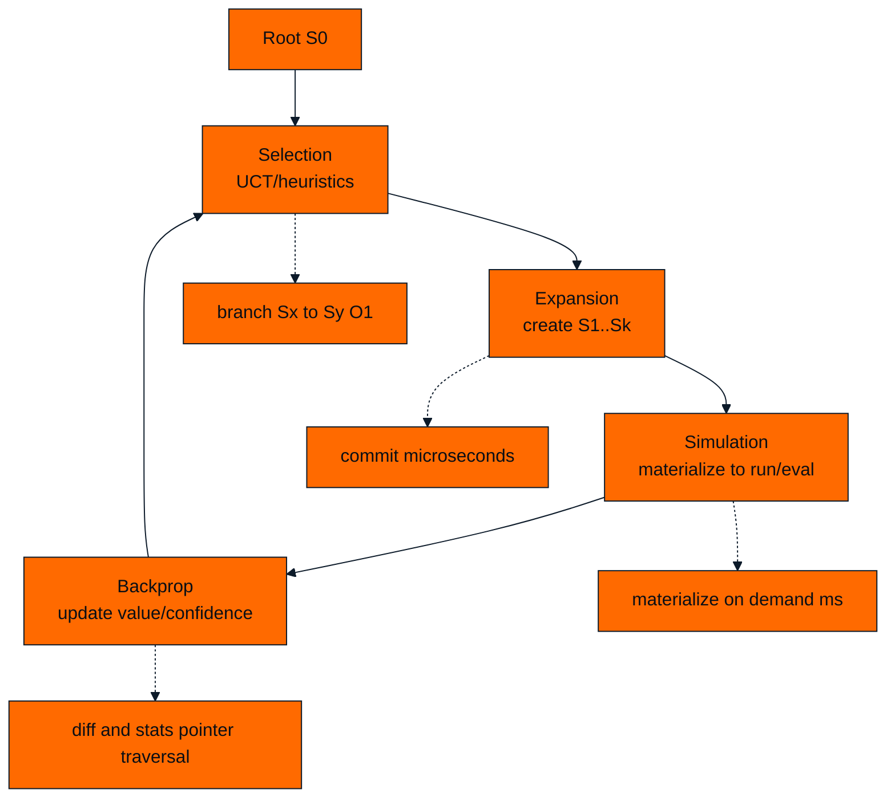

# LLM + MCTS + Helios Integration

Key points:
- MCTS (select/expand/simulate/backprop) leverages Helios microsecond snapshots.
- Massive branching/rollback/diff are pointer-level and cheap.

```mermaid
%%{init: { 'theme': 'base', 'themeVariables': {
  'primaryColor': '#FF6A00',
  'primaryTextColor': '#0A0E14',
  'primaryBorderColor': '#0D1B2A',
  'lineColor': '#0D1B2A',
  'secondaryColor': '#FFB08A',
  'tertiaryColor': '#8A60FF',
  'background': '#F6F4EE'
}} }%%
flowchart TD
  A[Root S0] --> B[Selection\nUCT/heuristics]
  B --> C[Expansion\ncreate S1..Sk]
  C --> D[Simulation\nmaterialize to run/eval]
  D --> E[Backprop\nupdate value/confidence]
  E --> B

  H1[branch Sx to Sy O1]
  H2[commit microseconds]
  H3[diff and stats pointer traversal]
  H4[materialize on demand ms]

  B -.-> H1
  C -.-> H2
  D -.-> H4
  E -.-> H3
```
