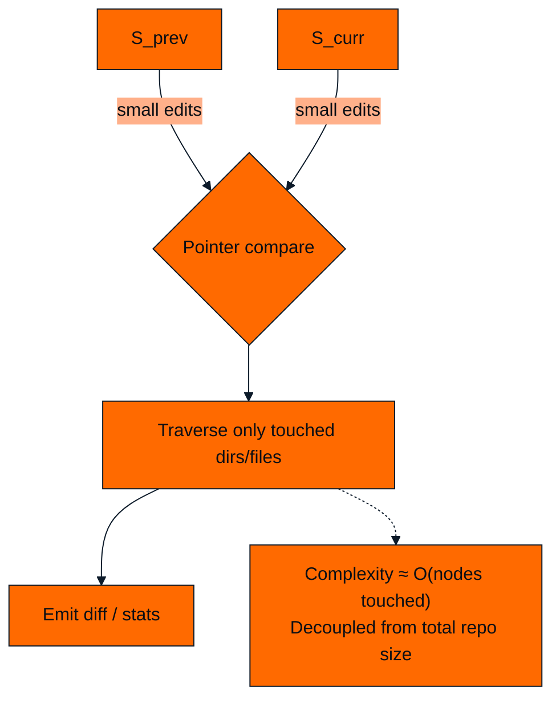

# diff/stats Pointer-Traversal Complexity (O(nodes touched))

Key points:
- diffs/stats operate at the L1 pointer layer; complexity scales with touched nodes, not repo size.

```mermaid
%%{init: { 'theme': 'base', 'themeVariables': {
  'primaryColor': '#FF6A00',
  'primaryTextColor': '#0A0E14',
  'primaryBorderColor': '#0D1B2A',
  'lineColor': '#0D1B2A',
  'secondaryColor': '#FFB08A',
  'tertiaryColor': '#8A60FF',
  'background': '#F6F4EE'
}} }%%
flowchart TD
  A[S_prev] -->|small edits| C{Pointer compare}
  B[S_curr] -->|small edits| C
  C --> D[Traverse only touched dirs/files]
  D --> E[Emit diff / stats]

  D -.-> N_NOTE["Complexity ≈ O(nodes touched)<br/>Decoupled from total repo size"]
```

