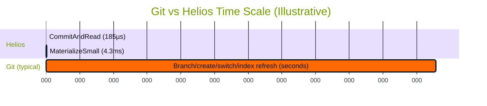

# Performance Timeline (Illustrative)

Key points:
- Visual scale difference: Helios microseconds/milliseconds vs Git seconds.

```mermaid
%%{init: { 'theme': 'base', 'themeVariables': {
  'primaryColor': '#FF6A00',
  'primaryTextColor': '#0A0E14',
  'primaryBorderColor': '#0D1B2A',
  'lineColor': '#0D1B2A',
  'secondaryColor': '#FFB08A',
  'tertiaryColor': '#8A60FF',
  'background': '#F6F4EE'
}} }%%
gantt
  title Git vs Helios Time Scale (Illustrative)
  dateFormat  X
  axisFormat  %L
  section Helios
  CommitAndRead (185µs)     :active, 0, 185
  MaterializeSmall (4.3ms)  : 0, 4300
  section Git (typical)
  Branch/create/switch/index refresh (seconds) : 0, 2000000
```

