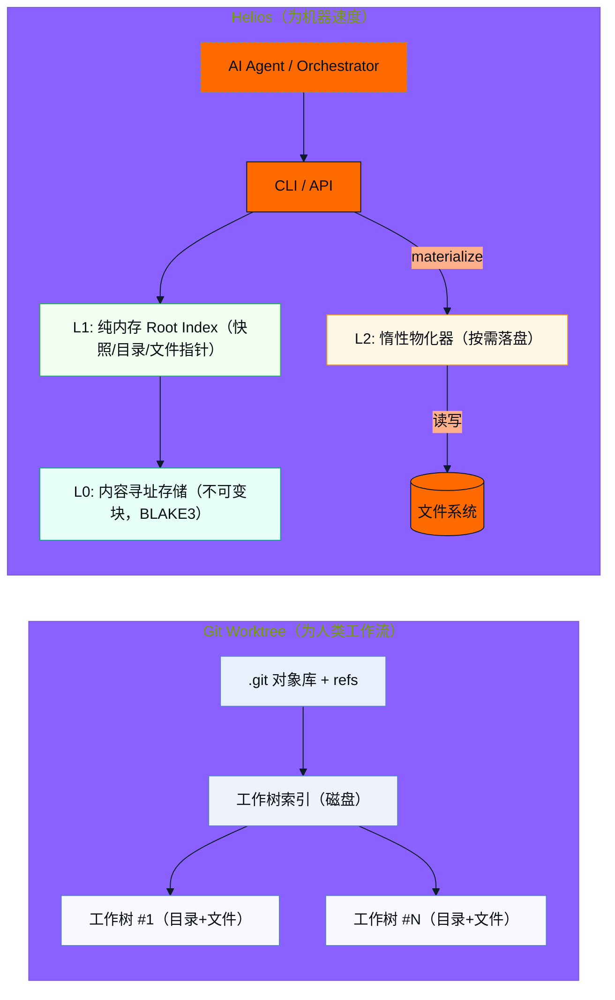

# Helios vs. Git Worktree 架构对照图

解读要点：
- Git 以磁盘文件/索引为核心；Helios 以不可变数据块 + 内存索引为核心。
- 分支/合并在 Helios 中多为指针级别操作，适合机器速度的海量分支。

```mermaid
%%{init: { 'theme': 'base', 'themeVariables': {
  'primaryColor': '#FF6A00',
  'primaryTextColor': '#0A0E14',
  'primaryBorderColor': '#0D1B2A',
  'lineColor': '#0D1B2A',
  'secondaryColor': '#FFB08A',
  'tertiaryColor': '#8A60FF',
  'background': '#F6F4EE'
}} }%%
flowchart LR
  subgraph Git_Worktree["Git Worktree（为人类工作流）"]
    GW_REPO[".git 对象库 + refs"]
    GW_INDEX["工作树索引（磁盘）"]
    GW_WT1["工作树 #1（目录+文件）"]
    GW_WT2["工作树 #N（目录+文件）"]
    GW_REPO --> GW_INDEX
    GW_INDEX --> GW_WT1
    GW_INDEX --> GW_WT2
  end

  subgraph Helios["Helios（为机器速度）"]
    H_L0["L0: 内容寻址存储（不可变块，BLAKE3）"]
    H_L1["L1: 纯内存 Root Index（快照/目录/文件指针）"]
    H_L2["L2: 惰性物化器（按需落盘）"]
    H_CLI["CLI / API"]
    H_AGENT["AI Agent / Orchestrator"]
    H_AGENT --> H_CLI --> H_L1
    H_L1 --> H_L0
    H_CLI -- materialize --> H_L2 -- 读写 --> FS[(文件系统)]
  end

  style GW_REPO fill:#e9f0fb,stroke:#5b7bd5
  style GW_INDEX fill:#eef2fb,stroke:#5b7bd5
  style GW_WT1 fill:#f7f9fe,stroke:#5b7bd5
  style GW_WT2 fill:#f7f9fe,stroke:#5b7bd5
  style H_L0 fill:#e6fff6,stroke:#16a085
  style H_L1 fill:#f0fff0,stroke:#27ae60
  style H_L2 fill:#fff7e6,stroke:#f39c12
  style H_AGENT stroke:#7f8c8d,stroke-dasharray: 4 2
```
