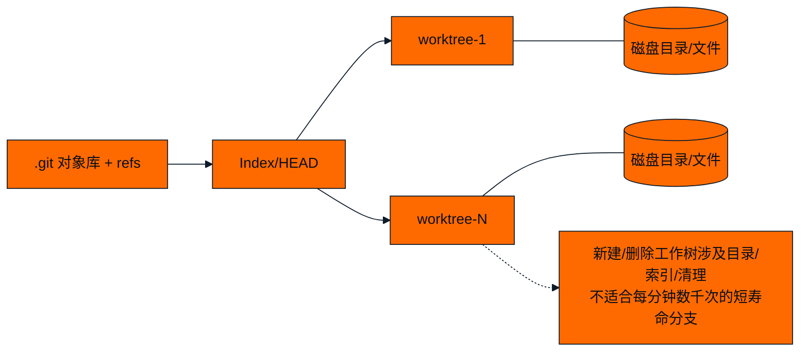

# Git Worktree 结构图（补充）

解读要点：
- 多工作树通过 refs 与磁盘索引/文件系统耦合；频繁分支/清理成本高。

```mermaid
%%{init: { 'theme': 'base', 'themeVariables': {
  'primaryColor': '#FF6A00',
  'primaryTextColor': '#0A0E14',
  'primaryBorderColor': '#0D1B2A',
  'lineColor': '#0D1B2A',
  'secondaryColor': '#FFB08A',
  'tertiaryColor': '#8A60FF',
  'background': '#F6F4EE'
}} }%%
flowchart LR
  GRepo[".git 对象库 + refs"] --> GIndex["Index/HEAD"]
  GIndex --> WT1["worktree-1"]
  GIndex --> WTN["worktree-N"]
  WT1 --- FS1[(磁盘目录/文件)]
  WTN --- FSN[(磁盘目录/文件)]
  WTN -.-> NOTE1["新建/删除工作树涉及目录/索引/清理<br/>不适合每分钟数千次的短寿命分支"]
```
