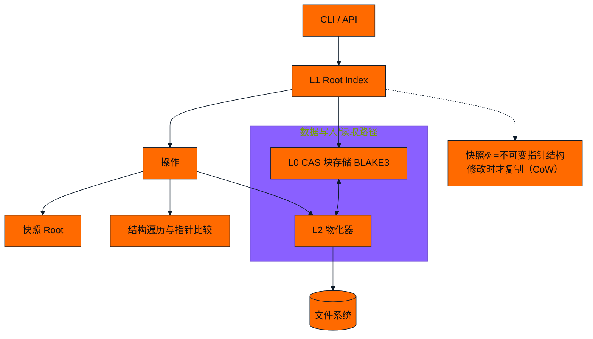

# Helios 内部组件架构图

解读要点：
- L1 纯内存索引承载快照/目录/文件的不可变指针结构；写时复制（CoW）仅在修改时发生。
- 统计/对比在指针层完成；执行时按需通过 L2 将数据从 L0 物化到磁盘。

```mermaid
%%{init: { 'theme': 'base', 'themeVariables': {
  'primaryColor': '#FF6A00',
  'primaryTextColor': '#0A0E14',
  'primaryBorderColor': '#0D1B2A',
  'lineColor': '#0D1B2A',
  'secondaryColor': '#FFB08A',
  'tertiaryColor': '#8A60FF',
  'background': '#F6F4EE'
}} }%%
flowchart TD
  A[CLI / API] --> B[L1 Root Index];
  B --> C[操作];
  C --> B1[快照 Root];
  C --> B2[结构遍历与指针比较];
  C --> D[L2 物化器];
  B --> E[L0 CAS 块存储 BLAKE3];
  D --> F[(文件系统)];

  subgraph DataFlow[数据写入/读取路径]
    E <--> D
  end

  B -.-> NOTE1["快照树=不可变指针结构<br/>修改时才复制（CoW）"]
```
