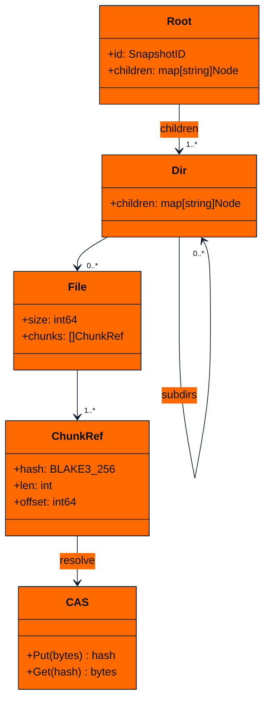

# 快照与数据块的数据模型结构图

解读要点：
- Root/Dir/File 为不可变结构；File 由有序块列表组成；块以哈希寻址。
- 指针共享 + 小粒度块带来天然的去重与低写放大。

```mermaid
%%{init: { 'theme': 'base', 'themeVariables': {
  'primaryColor': '#FF6A00',
  'primaryTextColor': '#0A0E14',
  'primaryBorderColor': '#0D1B2A',
  'lineColor': '#0D1B2A',
  'secondaryColor': '#FFB08A',
  'tertiaryColor': '#8A60FF',
  'background': '#F6F4EE'
}} }%%
classDiagram
  class Root {
    +id: SnapshotID
    +children: map[string]Node
  }
  class Dir {
    +children: map[string]Node
  }
  class File {
    +size: int64
    +chunks: []ChunkRef
  }
  class ChunkRef {
    +hash: BLAKE3_256
    +len: int
    +offset: int64
  }
  class CAS {
    +Put(bytes) hash
    +Get(hash) bytes
  }

  Root --> "1..*" Dir : children
  Dir --> "0..*" Dir : subdirs
  Dir --> "0..*" File
  File --> "1..*" ChunkRef
  ChunkRef --> CAS : resolve
```

