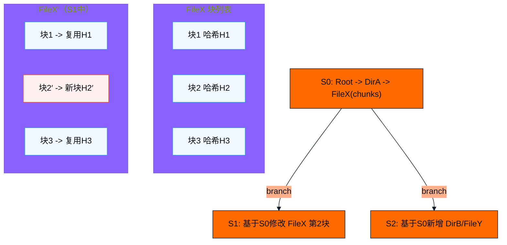

# Copy-on-Write 快照树示意图

解读要点：
- 修改仅作用于被触达路径，其余子树共享原始指针，避免全量复制。
- 分支/合并在指针层操作，接近 O(1) 成本。

```mermaid
%%{init: { 'theme': 'base', 'themeVariables': {
  'primaryColor': '#FF6A00',
  'primaryTextColor': '#0A0E14',
  'primaryBorderColor': '#0D1B2A',
  'lineColor': '#0D1B2A',
  'secondaryColor': '#FFB08A',
  'tertiaryColor': '#8A60FF',
  'background': '#F6F4EE'
}} }%%
flowchart TD
  S0["S0: Root -> DirA -> FileX(chunks)"]
  S1["S1: 基于S0修改 FileX 第2块"]
  S2["S2: 基于S0新增 DirB/FileY"]

  S0 -->|branch| S1
  S0 -->|branch| S2

  subgraph "FileX 块列表"
    X1[块1 哈希H1]:::blk
    X2[块2 哈希H2]:::blk
    X3[块3 哈希H3]:::blk
  end

  subgraph "FileX′（S1中）"
    X1a[块1 -> 复用H1]:::blk
    X2a[块2′ -> 新块H2′]:::newblk
    X3a[块3 -> 复用H3]:::blk
  end

  classDef blk fill:#f0f8ff,stroke:#3498db;
  classDef newblk fill:#fff0f0,stroke:#e74c3c;
```
