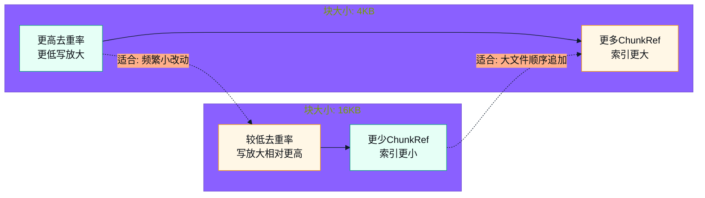

# CoW 写放大与块大小选择（4KB vs 16KB 示例）

解读要点：
- 块越小，细粒度共享越强，写放大下降；但元数据与寻址开销上升。
- 选择块大小需权衡“修改局部性 vs 元数据成本”。

```mermaid
%%{init: { 'theme': 'base', 'themeVariables': {
  'primaryColor': '#FF6A00',
  'primaryTextColor': '#0A0E14',
  'primaryBorderColor': '#0D1B2A',
  'lineColor': '#0D1B2A',
  'secondaryColor': '#FFB08A',
  'tertiaryColor': '#8A60FF',
  'background': '#F6F4EE'
}} }%%
flowchart LR
  subgraph Small[块大小: 4KB]
    S1[更高去重率\n更低写放大]:::good --> S2[更多ChunkRef\n索引更大]:::warn
  end
  subgraph Large[块大小: 16KB]
    L1[较低去重率\n写放大相对更高]:::warn --> L2[更少ChunkRef\n索引更小]:::good
  end
  S1 -. 适合: 频繁小改动 .-> L1
  L2 -. 适合: 大文件顺序追加 .-> S2

  classDef good fill:#e6fff6,stroke:#16a085;
  classDef warn fill:#fff7e6,stroke:#f39c12;
```

