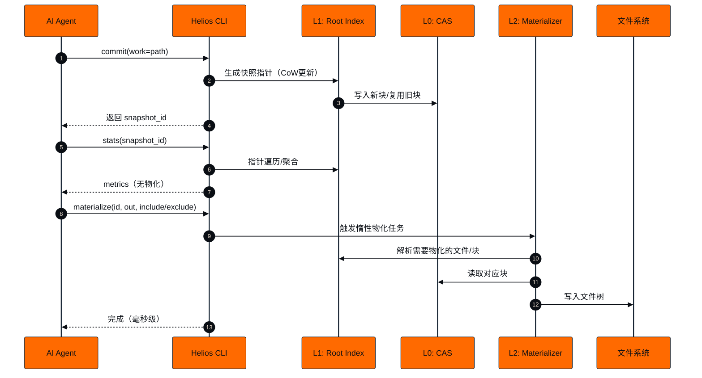

# 惰性物化（Lazy Materialization）时序图

解读要点：
- 仅在需要执行（编译/测试/运行）时才将所需路径物化至磁盘。
- 普通统计/对比在 L1 指针层完成，无需物化。

```mermaid
%%{init: { 'theme': 'base', 'themeVariables': {
  'primaryColor': '#FF6A00',
  'primaryTextColor': '#0A0E14',
  'primaryBorderColor': '#0D1B2A',
  'lineColor': '#0D1B2A',
  'secondaryColor': '#FFB08A',
  'tertiaryColor': '#8A60FF',
  'background': '#F6F4EE'
}} }%%
sequenceDiagram
  autonumber
  participant Agent as AI Agent
  participant CLI as Helios CLI
  participant L1 as L1: Root Index
  participant L0 as L0: CAS
  participant L2 as L2: Materializer
  participant FS as 文件系统

  Agent->>CLI: commit(work=path)
  CLI->>L1: 生成快照指针（CoW更新）
  L1->>L0: 写入新块/复用旧块
  CLI-->>Agent: 返回 snapshot_id

  Agent->>CLI: stats(snapshot_id)
  CLI->>L1: 指针遍历/聚合
  CLI-->>Agent: metrics（无物化）

  Agent->>CLI: materialize(id, out, include/exclude)
  CLI->>L2: 触发惰性物化任务
  L2->>L1: 解析需要物化的文件/块
  L2->>L0: 读取对应块
  L2->>FS: 写入文件树
  CLI-->>Agent: 完成（毫秒级）
```

