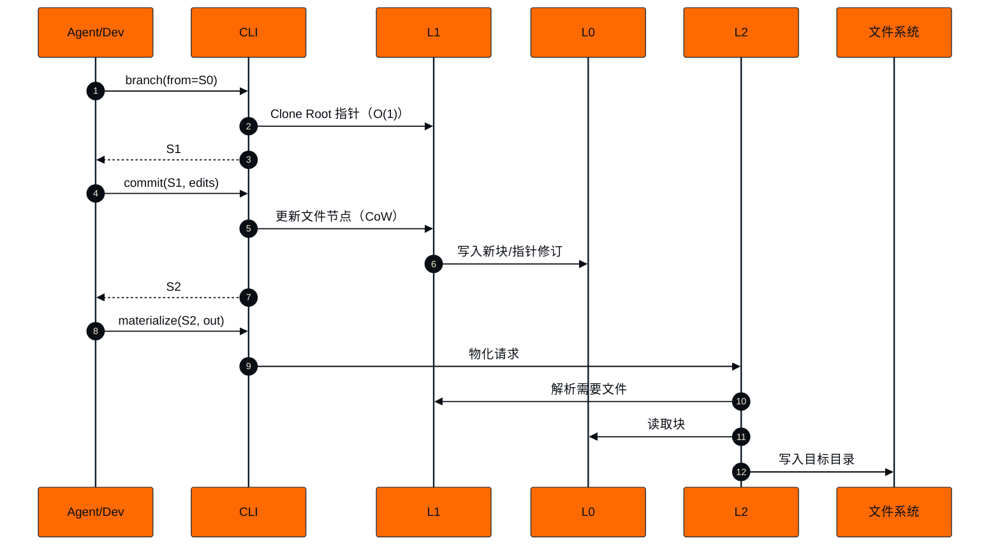

# 核心工作流（提交/分支/物化）时序图

解读要点：
- 分支=新 Root 指针创建；提交=CoW 更新；物化仅在执行需要时发生。

```mermaid
%%{init: { 'theme': 'base', 'themeVariables': {
  'primaryColor': '#FF6A00',
  'primaryTextColor': '#0A0E14',
  'primaryBorderColor': '#0D1B2A',
  'lineColor': '#0D1B2A',
  'secondaryColor': '#FFB08A',
  'tertiaryColor': '#8A60FF',
  'background': '#F6F4EE'
}} }%%
sequenceDiagram
  autonumber
  participant Dev as Agent/Dev
  participant CLI as CLI
  participant L1 as L1
  participant L0 as L0
  participant L2 as L2
  participant FS as 文件系统

  Dev->>CLI: branch(from=S0)
  CLI->>L1: Clone Root 指针（O(1)）
  CLI-->>Dev: S1

  Dev->>CLI: commit(S1, edits)
  CLI->>L1: 更新文件节点（CoW）
  L1->>L0: 写入新块/指针修订
  CLI-->>Dev: S2

  Dev->>CLI: materialize(S2, out)
  CLI->>L2: 物化请求
  L2->>L1: 解析需要文件
  L2->>L0: 读取块
  L2->>FS: 写入目标目录
```

