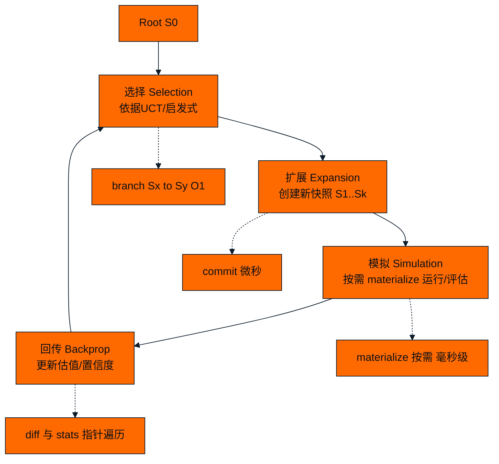

# LLM + MCTS + Helios 集成流程图

解读要点：
- MCTS 的选择/扩展/模拟/回传阶段可由 Helios 的微秒级快照能力驱动。
- 大量分支的创建/回滚/对比在指针层完成，极大降低成本。

```mermaid
%%{init: { 'theme': 'base', 'themeVariables': {
  'primaryColor': '#FF6A00',
  'primaryTextColor': '#0A0E14',
  'primaryBorderColor': '#0D1B2A',
  'lineColor': '#0D1B2A',
  'secondaryColor': '#FFB08A',
  'tertiaryColor': '#8A60FF',
  'background': '#F6F4EE'
}} }%%
flowchart TD
  A[Root S0] --> B[选择 Selection\n依据UCT/启发式]
  B --> C[扩展 Expansion\n创建新快照 S1..Sk]
  C --> D[模拟 Simulation\n按需 materialize 运行/评估]
  D --> E[回传 Backprop\n更新估值/置信度]
  E --> B

  H1[branch Sx to Sy O1]
  H2[commit 微秒]
  H3[diff 与 stats 指针遍历]
  H4[materialize 按需 毫秒级]

  B -.-> H1
  C -.-> H2
  D -.-> H4
  E -.-> H3
```
