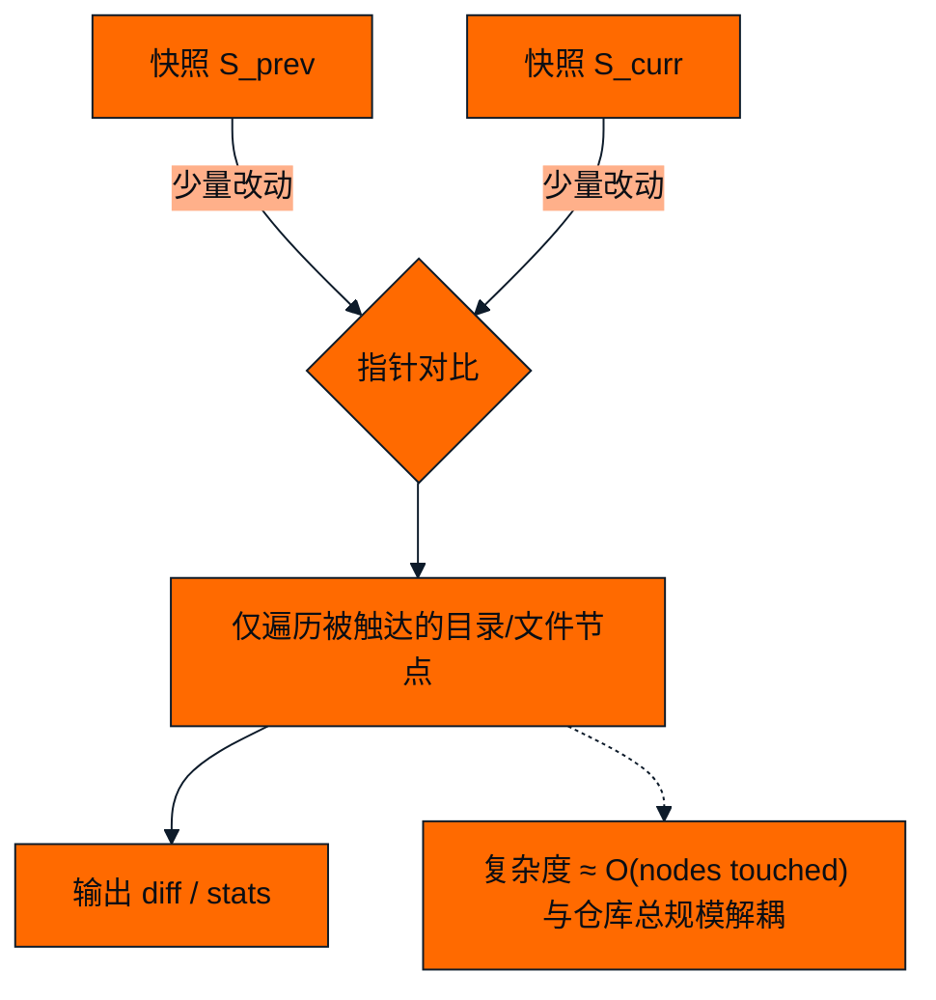

# diff/stats 的指针遍历复杂度（O(nodes touched)）

解读要点：
- diff/stats 在 L1 指针层进行，复杂度与“触达的节点数量”相关，而非与整个仓库体量相关。

```mermaid
%%{init: { 'theme': 'base', 'themeVariables': {
  'primaryColor': '#FF6A00',
  'primaryTextColor': '#0A0E14',
  'primaryBorderColor': '#0D1B2A',
  'lineColor': '#0D1B2A',
  'secondaryColor': '#FFB08A',
  'tertiaryColor': '#8A60FF',
  'background': '#F6F4EE'
}} }%%
flowchart TD
  A[快照 S_prev] -->|少量改动| C{指针对比}
  B[快照 S_curr] -->|少量改动| C
  C --> D[仅遍历被触达的目录/文件节点]
  D --> E[输出 diff / stats]

  D -.-> N_NOTE["复杂度 ≈ O(nodes touched)<br/>与仓库总规模解耦"]
```

