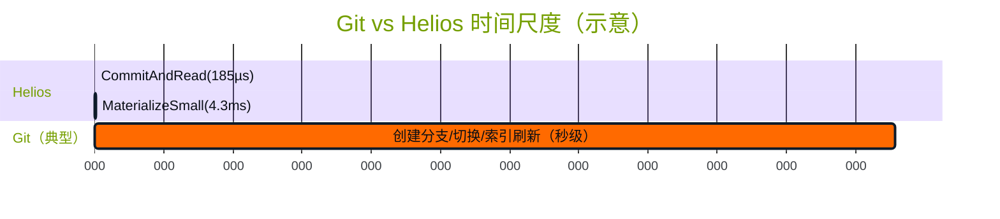

# 性能对照时间轴（示意）

解读要点：
- 以时间尺度展示 Helios 的微秒/毫秒操作与 Git 秒级操作的直观差异。

```mermaid
%%{init: { 'theme': 'base', 'themeVariables': {
  'primaryColor': '#FF6A00',
  'primaryTextColor': '#0A0E14',
  'primaryBorderColor': '#0D1B2A',
  'lineColor': '#0D1B2A',
  'secondaryColor': '#FFB08A',
  'tertiaryColor': '#8A60FF',
  'background': '#F6F4EE'
}} }%%
gantt
  title Git vs Helios 时间尺度（示意）
  dateFormat  X
  axisFormat  %L
  section Helios
  CommitAndRead(185µs)     :active, 0, 185
  MaterializeSmall(4.3ms)  : 0, 4300
  section Git（典型）
  创建分支/切换/索引刷新（秒级） : 0, 2000000
```

